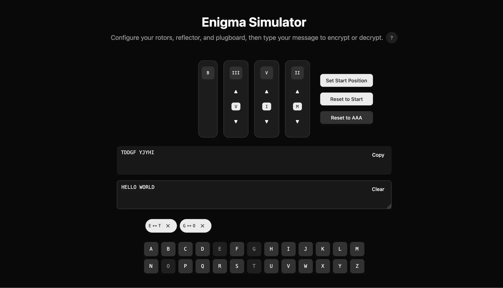

# Enigma Simulator



An online Enigma machine simulator. Encrypt and decrypt messages using configurable rotors, reflectors, and plugboard settings.

<https://enigma.ziteh.dev>

Tech stack:

- React
- Vite
- [shadcn/ui](https://ui.shadcn.com/)
- [Lucide icons](https://lucide.dev/)

## Usage

```bash
pnpm i
pnpm dev
```

## Enigma

[`enigma.ts`](./src/lib/enigma.ts)

## Ref

- [Enigma wiring](https://www.cryptomuseum.com/crypto/enigma/wiring.htm)
- [Enigma machine - Wikipedia](https://en.wikipedia.org/wiki/Enigma_machine)
